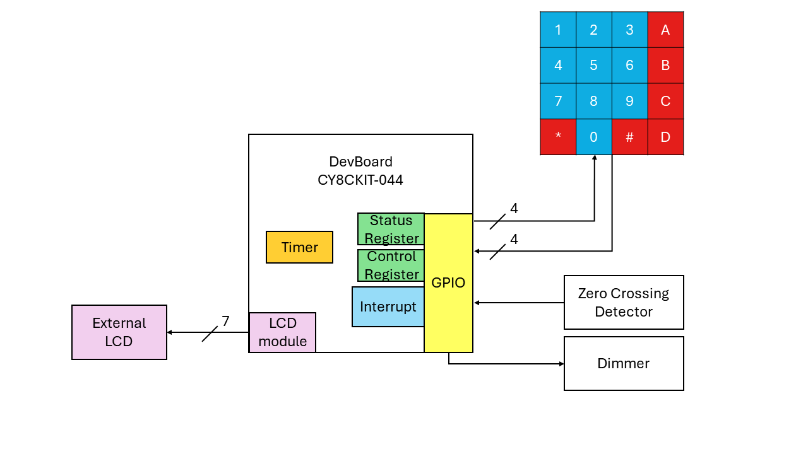
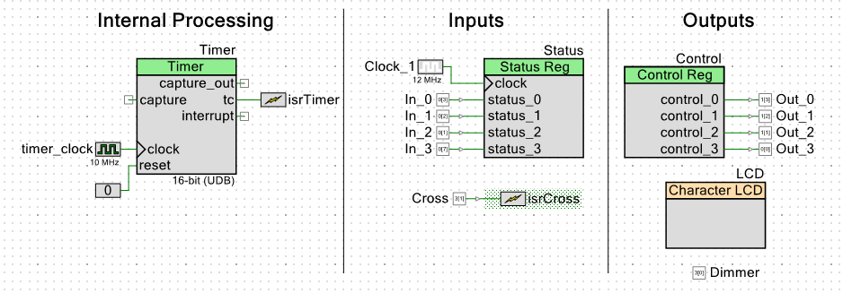

# Digital Dimmer

1. **Microcontroller:** Embedded system designed to manipulate intensity and duration of AC devices (light bulbs or motors).
    ~~~
    Development Board: CY8CKIT-044 / PSoC 4 M-Series Pioneer Kit
    Manufacturer:Cypress Semiconductor Corporation
    ~~~
2. **Diagrams:**
    ~~~
    1. Block Diagram
    2. Microcontroller Diagram 
        1. TopDesign
        2. Pins
    ~~~

**Features applied:**
  1. Status Register
  2. Control Register
  3. Timer
  4. Character LCD
  5. Interrupts
  6. GPIO pins

